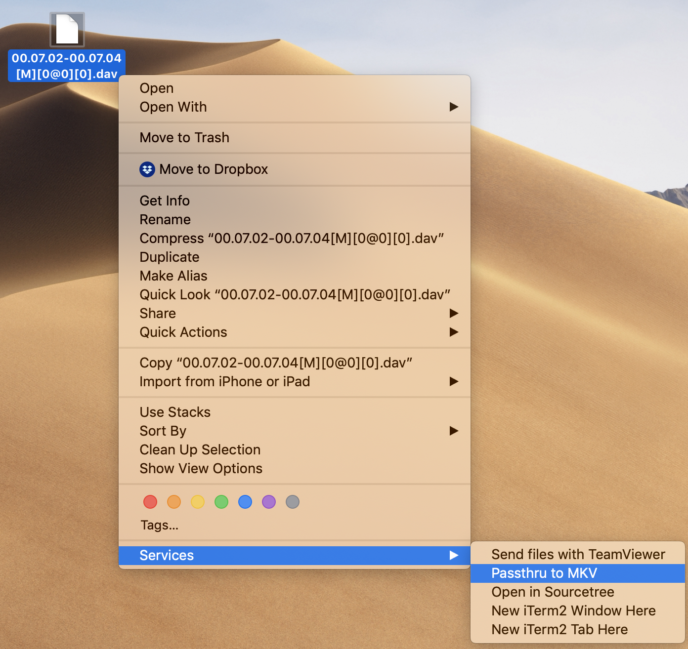

# ffmpeg-passthru-finder-action
Automator quick action to passthru streams of selected media files to MKV container.

[See Demo](demo.mp4)

## Why was this created?
My camera outputs recordings to a DAV file format.  Unfortunately this isn't a very compatible format, and the only way to get VLC to play it is to mess around with some deep settings that I'd rather not touch.  I happen to know that my camera is just recording a H.265 stream, which will playback perfectly if I do a passthrough to a MKV container.  After a quick proof of concept with ffmpeg (i.e. `ffmpeg -i input.dav -codec copy output.mkv`) I put together this automator action.  

## Requirements
Assumes [ffmpeg](https://ffmpeg.org) is already installed at `/usr/local/bin/ffmpeg`

## What this action does
This "Quick Action" adds "Passthru to MKV" as an option under "Services" when you right-click a file.  A new file will be created in the same directory with a '.mkv' extension.  If multiple files are selected, only those with an extension in the `handled_file_exts` array will be converted.


If you inspect the workflow you will see it simply amounts to the following bash script

```
#array of file extensions that will be converted
handled_file_exts=("dav" "mkv" "mp4" "m4v" "m4p")

#finder items passed in as arguments, so first we need to loop over all arguments
IFS=$'\n'
for full_input_path in "$@"
do

	#paramater expansion to remove file extension
	full_input_path_no_ext=${full_input_path%.*}

	#http://www.tldp.org/LDP/abs/html/parameter-substitution.html#PSUB2
	file_ext=${full_input_path##*.}

	#create output path
	full_output_path=$full_input_path_no_ext
	full_output_path+=".mkv"

	#check if the file extension is one we want to handle
	if printf '%s\n' ${handled_file_exts[@]} | grep -q -i -e "^$file_ext$"; then

    	#use ffmpeg to pass the video stream through to a new container
		/usr/local/bin/ffmpeg -i "${full_input_path}" -codec copy "${full_output_path}"

	fi

done

```

## How to install
* Clone or download this repo
* Double-click on the "Passthru to MKV.workflow" file to prompt MacOS to install it.
* (Bonus Points) Go to "System Preferences > Keyboard > Shortcuts > Services > Passthru to MKV" and assign a shortcut.  I use Command-Shift-M.
